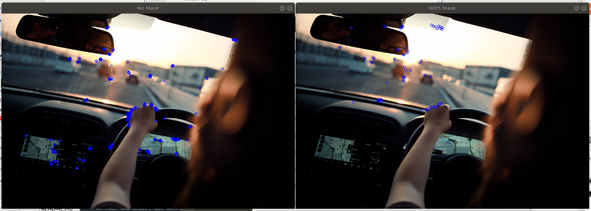

# webcam_point_features
Detection of ORB features from online webcam images.

## What is ORB?

ORB is an algorithm used in computer vision for detecting local features, that is, interesting points within an image. Its acronym ORB stands for Oriented FAST and Rotated BRIEF. FAST (Features from Accelerated Segment Test) is also a keypoint detector based on a corner detection algorithm, specially designed to be computationally efficient. FAST is suitable for real-time video processing because of its performance.
On the other hand, BRIEF (Binary Robust Independent Elementary Feature) is a feature descriptor. This means, it does not search keypoints in images, it just "describes" the detected keypoint.

ORB was created mainly because other well-known algorithms, such as SIFT and SURF, are patented and therefore not free to use. So ORB is a combination of detecting keypoints in an image and then creating a descriptor for that point that is based on FAST and BRIEF, but with improved characteristics.

## Sources:

Wikipedia: https://en.wikipedia.org/wiki/Oriented_FAST_and_rotated_BRIEF

Medium: https://medium.com/@deepanshut041/introduction-to-orb-oriented-fast-and-rotated-brief-4220e8ec40cf

OpenCV: https://docs.opencv.org/master/dc/d7d/tutorial_py_brief.html

Paper: http://www.willowgarage.com/sites/default/files/orb_final.pdf

## Usage
After compiling with the usual steps, you have two options:

a) Run the real-time keypoint detector:
```
./point_features
```

b) Compare test images for the mask:
```
./compare_orb <input_image> <factor>
```
**input_image**: is the path to the image to load and test

**factor**: a percent between 0.0 and 1.0 of the total image area to used for searching

For example:

```
./compare_orb ../images/img1.jpg 0.5
```

## Masking
You can limit the area to search for keypoints inside the image with the mask parameter. This is just a region of interest (ROI) and will discard the rest of the image. Here you can see 2 images when searching in the 100% of the image or only in the 25% of it.


